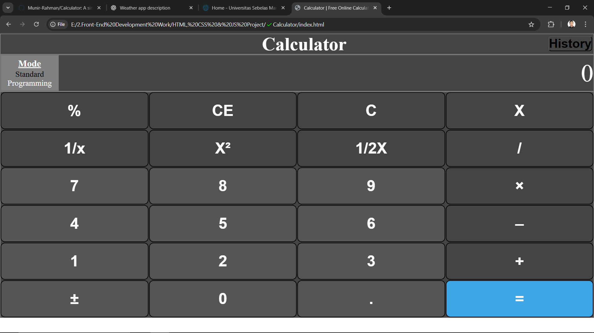

# 🧮 Multi-Mode Calculator

A versatile and interactive **Calculator** built with **HTML**, **CSS**, and **JavaScript** that supports both **Standard** and **Programmer** modes.  
Features basic arithmetic operations, history tracking, and binary-to-decimal conversion with a responsive and user-friendly interface.

---

## 📸 Screenshot



---

## 🚀 Features

- 🔢 Standard Calculator mode:
  - Addition, Subtraction, Multiplication, Division
  - Percentage (%), Square, Square Root
  - Reciprocal (1/x), Plus/Minus toggle (±)
  - Clear and Reset functions
  - Operation chaining with live display
- 💻 Programmer Calculator mode:
  - Binary to Decimal conversion
  - Binary input support (0s and 1s)
- 🕘 History panel to track recent calculations
- 🎨 Dynamic button styling and hover effects
- ⌨️ Keyboard support for number entry and execution
- Responsive design adaptable to different devices

---

## 🛠️ Technologies Used

- HTML5  
- CSS3 (including dynamic styles)  
- JavaScript (Vanilla)

---

## 📦 Getting Started

### 1. Clone the repository

```bash
git clone https://github.com/your-username/multi-mode-calculator.git
cd multi-mode-calculator
```

## 2. Open in Browser
Simply open index.html in your preferred web browser to start using the calculator.

## 🧠 How It Works
- Mode Selection: Users toggle between Standard and Programmer modes using buttons.
- Standard Mode supports basic and extended arithmetic with visual feedback on buttons.
- Programmer Mode lets users input binary numbers and convert them to decimal.
- History Panel stores and displays previous calculations dynamically.
- User inputs via mouse clicks or keyboard keypresses trigger respective calculation functions.
- Validation prevents invalid operations like multiple decimal points or consecutive operators.

## 📁 Project Structure
multi-mode-calculator/
├── index.html

├── style.css

├── script.js

├── img/
│   └── calculator-screenshot.png
└── README.md

## 📄 License
This project is licensed under the MIT License.
Feel free to use, modify, and share it.

## 👨‍💻 Author
Munir Rahman
Front-End Web Developer

## ⭐ Support
If you find this project useful, please give it a ⭐ on GitHub!


---

If you want, I can also help you with:

- Adding installation instructions (if you add build tools later)
- Writing user guides for calculator functions
- Translating this README to Pashto

Just let me know!
